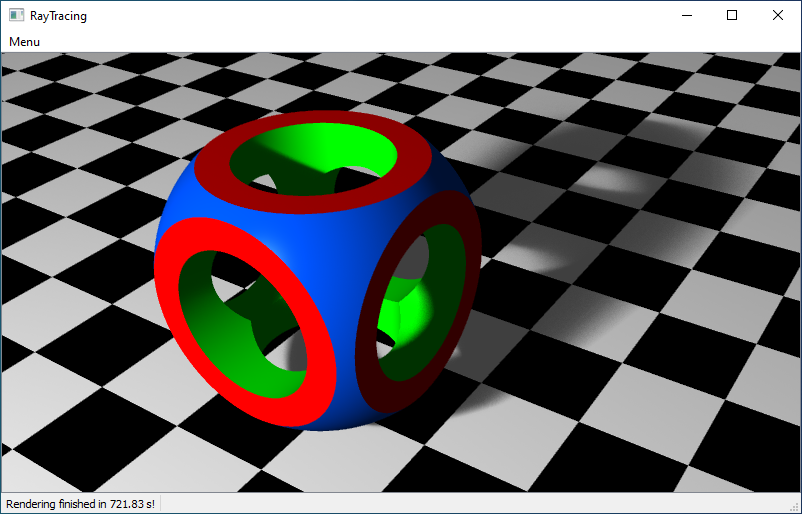
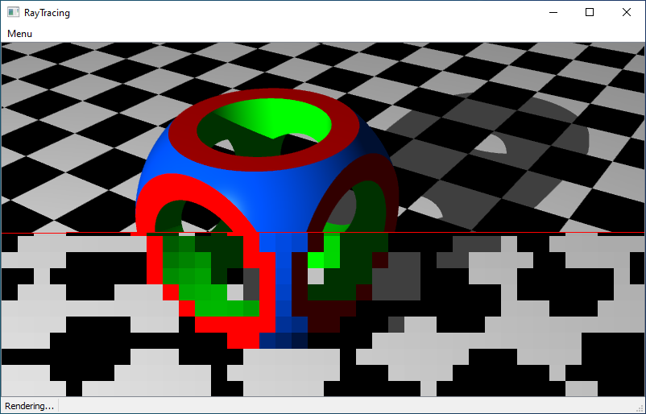
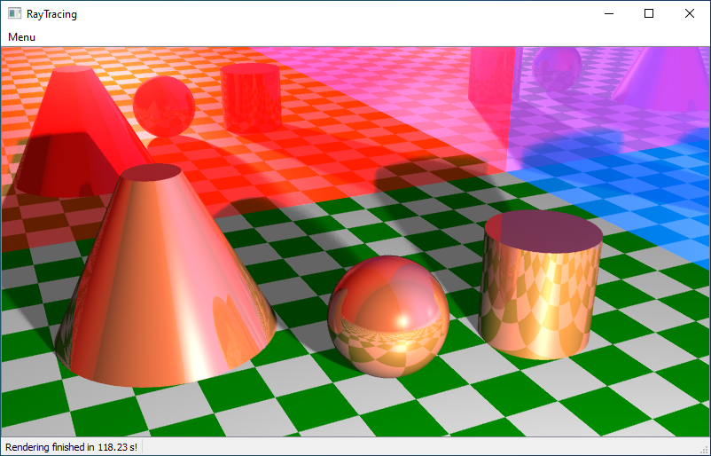
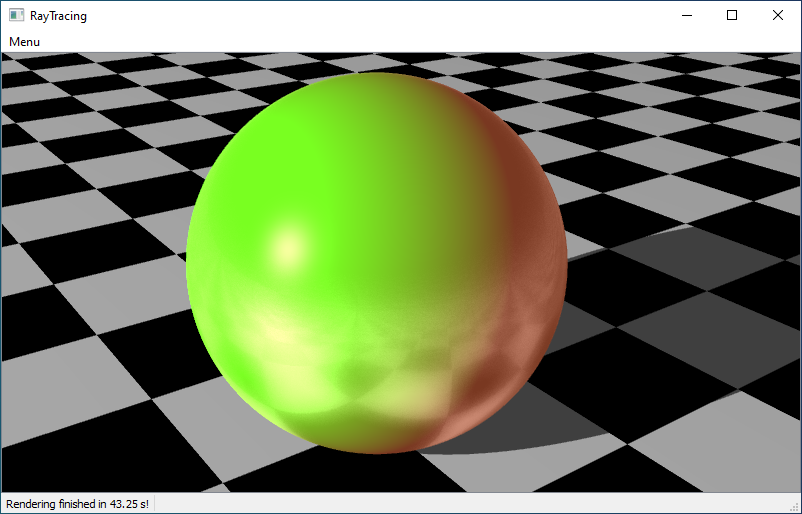
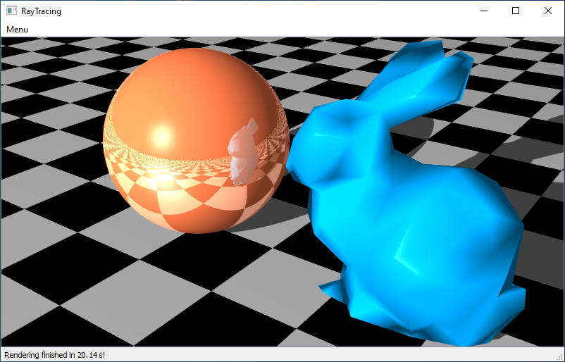
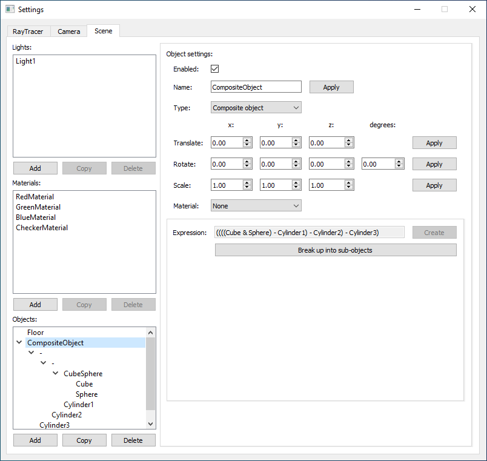
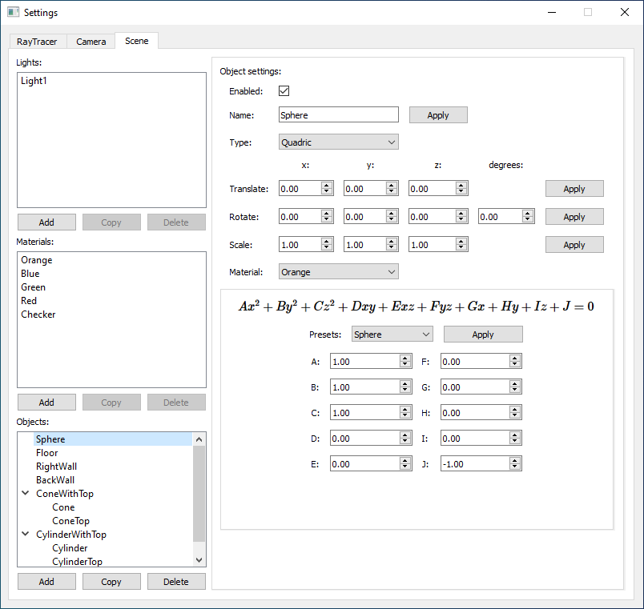
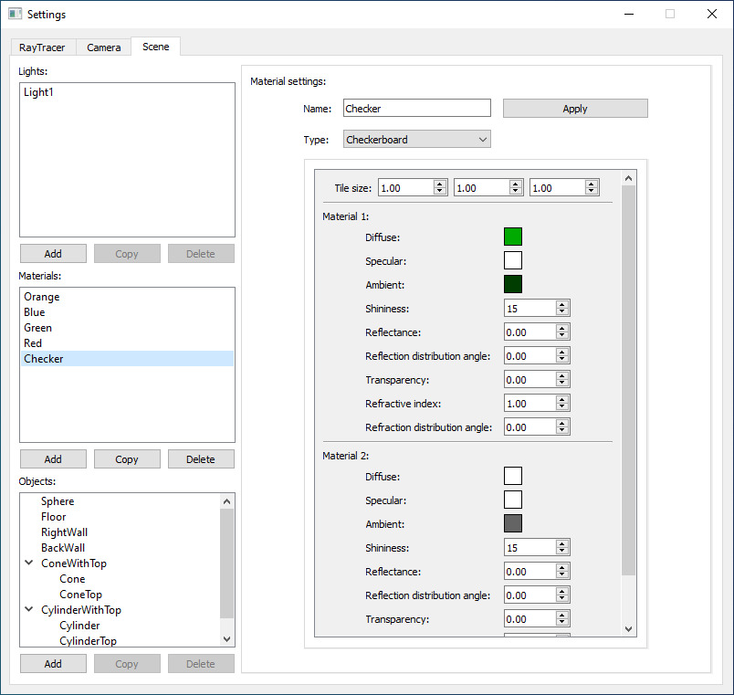

# RayTracer

RayTracing application with a GUI. 

### External libraries:

- Qt5
- Assimp

### Features:

- rendering general quadrics 
- loading model files and rendering the models
- constructive solid geometry operations specified in the form of expressions: 
  - union: `object1 | object2`
  - intersection: `object1 & object2`
  - difference: `object1 - object2`
  - clipping by a plane: `object / plane`
- adaptive supersampling
- recursion
- lights
  - point lights
  - sphere lights
- materials
  - Phong properties 
  - reflectiveness
  - transparency
  - refractive index
- distributed raytracing
  - soft shadows
  - blurry reflections
  - blurry refractions
- camera
  - perspective projection 
  - orthogonal projection
  - can be freely moved in the scene by keyboard and mouse from a first person view
  - subsampling is used and most features are turned off during camera movement so it can be smooth
- GUI for creating or modifying simple scenes which can consist of a number of lights, materials and objects 
- saving scenes to files and loading them back into the program
- saving rendered images

### Images:

An object created using constructive solid geometry from a cube, a sphere and three cylinders casting a soft shadow:

Partially rendered scene:

Some clipped quadrics, reflections and soft shadows:

Blurred reflection:

Low-poly model of the Stanford bunny reflected in a sphere:

GUI:

